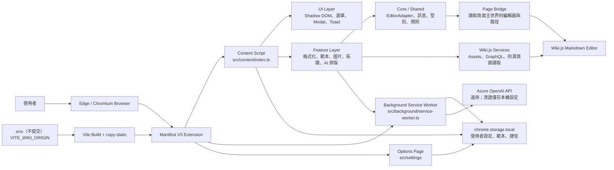

# Freedom Wiki Assistant

以 TypeScript 開發的 Chromium Manifest V3 瀏覽器擴充功能，為採用 Wiki.js Markdown 編輯器的 Wiki 站點提供格式化、範本、圖片與文章結構輔助。

此專案不內含任何實際 Wiki 網域、帳號、文章內容或 API Key；目標站點在建置時由本機環境變數設定。

## 專案解決的問題

Wiki.js 的原生 Markdown 編輯流程適合基本撰寫，但重複套用格式、插入圖片、管理常用範本與檢視頁面階層仍需要大量手動操作。本擴充功能在不改動 Wiki 伺服器的前提下，將這些常見工作整合到編輯器旁的介面。

## 主要功能

- 右鍵格式選單：文字顏色、字級、醒目提示與底線。
- 快速排版與 AI 排版：前者在本機依規則處理；後者可選擇使用使用者於選項頁設定的 Azure OpenAI。
- 圖片拖放、貼上與上傳：支援 Wiki.js Assets 流程，並可依文章路徑推導資料夾。
- Assets 檢視：瀏覽資料夾及子資料夾的圖片，並提供重新命名與刪除操作。
- 範本與 placeholders：可建立、匯入、匯出及套用含日期等替代字串的範本。
- 客戶／頁面捷徑、頁面拓譜、側欄色彩與浮動小工具。
- SPA 感知：Wiki 頁面切換或編輯器重新掛載時會自動清理並重新初始化功能。

## 系統架構



### Data Flow

1. 瀏覽器僅在 `VITE_WIKI_ORIGIN` 指定的 Wiki origin 注入 Content Script。
2. Content Script 偵測 Markdown 編輯器，透過 Page Bridge 取得必要的編輯器操作能力與目前頁面資訊。
3. 使用者動作進入 Feature Layer；純文字格式化直接經 `EditorAdapter` 寫回編輯器。
4. 圖片與資產操作透過既有登入 session 對 Wiki.js 同源端點發出請求；不將 cookie 或 JWT 寫入擴充功能儲存空間。
5. 範本、顯示偏好與 Azure 設定存在 `chrome.storage.local`。AI 請求只由 Background Service Worker 執行，Content Script 不會收到 API Key。

## 專案結構

```text
src/
├── background/        # Service Worker 與 AI 排版協調
├── config/            # Wiki origin、編輯器與 Assets 行為設定
├── content/           # 注入頁面的功能、UI、Bridge 與 Wiki.js 整合
├── customers/         # 客戶／頁面捷徑資料服務
├── pet/               # 浮動小工具靜態資產與元件
├── settings/          # 擴充功能選項頁
├── shared/            # 型別、Chrome storage、訊息與排版規則
├── styles/            # 擴充功能樣式
└── templates/         # 範本 CRUD 與 placeholder 處理
scripts/
├── copy-static.mjs    # 依環境變數產生正式 manifest 與複製靜態檔
└── gen-layout-rules.mjs
tests/                 # Vitest 單元測試
manifest.json          # 不含實際網域的 MV3 manifest 範本
```

## 核心模組

| 模組 | 職責 |
| --- | --- |
| `src/content/index.ts` | Content Script 入口、SPA 監聽與功能生命週期管理。 |
| `src/content/editor-adapter.ts`、`page-bridge.ts` | 抽象 textarea、CodeMirror、Monaco、Ace 等編輯器的讀寫操作。 |
| `src/content/wikijs-upload.ts` | Wiki.js Assets 的資料夾、上傳、列舉、重新命名與刪除流程。 |
| `src/content/quick-format.ts`、`src/background/ai-layout-service.ts` | 本機快速排版與選用 AI 排版。 |
| `src/templates/`、`src/customers/` | 使用者範本與捷徑的 storage-backed CRUD。 |
| `src/shared/storage.ts` | 唯一存取 `chrome.storage.local` 的封裝。 |
| `src/shared/azure-openai-client.ts` | 僅於 Background 使用的 Azure OpenAI Chat Completions Client。 |

## 開發環境

- Node.js 18 以上（建議使用目前 LTS）。
- npm。
- Microsoft Edge、Google Chrome 或相容的 Chromium 瀏覽器。
- 可存取的 HTTPS Wiki.js 2.x 站點（實際安裝與測試時）。

## 安裝與啟動

```powershell
npm install
Copy-Item .env.example .env
```

編輯本機 `.env`，填入授權使用的目標站點：

```dotenv
VITE_WIKI_ORIGIN=https://wiki.example.invalid
```

接著執行：

```powershell
npm run build
```

建置產物會位於 `dist/`。到 Chromium 擴充功能管理頁開啟「開發人員模式」，選擇「載入解壓縮」，再選取 `dist/`。

常用開發指令：

```powershell
npm run typecheck
npm run lint
npm test
npm run build
```

`npm run dev` 目前等同於執行完整 build，並非常駐的檔案監看伺服器。

## Configuration / Environment Variables

| 變數 | 必填 | 說明 |
| --- | --- | --- |
| `VITE_WIKI_ORIGIN` | 是 | 目標 Wiki 的 HTTPS origin，例如 `https://wiki.example.invalid`；不可帶路徑、查詢字串或結尾斜線。 |

建置時，Vite 會將此值編譯至程式碼，`scripts/copy-static.mjs` 也會以同一值產生 `dist/manifest.json` 的 `host_permissions` 與注入比對規則。未設定時會使用不可路由的假網域，因此不會意外連線到任何站點。

Azure OpenAI 的 Endpoint、Deployment、API Key 與 API Version 由擴充功能選項頁設定，僅存於使用者本機的 `chrome.storage.local`，不屬於 `.env`、原始碼或 Git Repository。

## 使用方式

1. 在目標 Wiki 的 Markdown 編輯頁開啟擴充功能。
2. 反白文字後以右鍵選單套用格式，或從主選單開啟範本、快速排版、AI 排版及圖片功能。
3. 圖片可直接拖曳到編輯器或貼上；依設定選擇目前文章路徑、父資料夾或手動資料夾。
4. 需要 AI 排版時，先在擴充功能選項頁填入自己的 Azure OpenAI 設定，再從功能選單啟動。

## 安全注意事項

- 不要提交 `.env`、私鑰、憑證、瀏覽器操作紀錄、真實 Wiki 文章、客戶資料或 API Key。
- `manifest.json` 與 `.env.example` 僅含假網域；實際 origin 僅應存於每位開發者的本機 `.env` 或受管控的 CI secret。
- AI API Key 不可寫死在程式碼或 Build-time Environment Variable；請只透過選項頁保存於本機 Chrome storage。
- Wiki.js 上傳會使用使用者既有登入 session。請依組織權限控管 Wiki 端的讀寫與 Assets 權限。
- 任何新增設定檔或測試證據在 commit 前都應重新檢查內容；`.gitignore` 是防線之一，不是唯一防線。

## 目前專案狀態

專案目前已具備可建置的 Manifest V3 擴充功能、TypeScript 型別檢查、ESLint 與 Vitest 測試。功能與介面維持既有實作；本次整理僅新增安全的 Wiki origin 建置設定、文件與 Git 排除規則，未重構既有功能。
