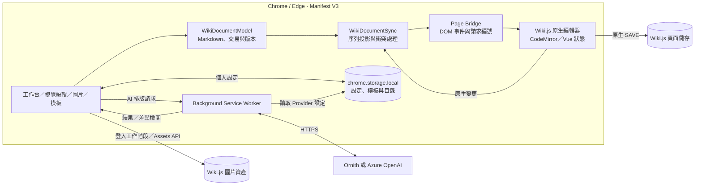

<p align="center"></p>
<h1 align="center">Wiki Studio</h1>
<p align="center"><strong>Freedom Wiki Assistant · 讓知識文件，更好寫、更好整理。</strong></p>
<p align="center">視覺編輯 · 圖片資料庫 · 模板與客戶目錄 · AI 排版</p>
<p align="center">
  <a href="https://github.com/tigerhzu/freedom-wiki-assistant/releases/latest"></a>
  
  
  
</p>

<picture>
  <source media="(prefers-reduced-motion: reduce)" srcset="docs/assets/hero-static.svg" />
  
</picture>

<p align="center">
  <a href="https://github.com/tigerhzu/freedom-wiki-assistant/releases/latest">下載發行版</a> ·
  <a href="docs/INSTALL.md">安裝指南</a> ·
  <a href="docs/ARCHITECTURE.md">架構與資料流</a> ·
  <a href="docs/DEVELOPMENT.md">開發文件</a> ·
  <a href="docs/CHANGELOG.md">版本紀錄</a>
</p>

Wiki Studio 是為 **Wiki.js 2.x Markdown 編輯頁**打造的 Chrome／Edge 擴充功能。從直接編輯文章、拖入圖片，到插入模板與檢閱 AI 排版結果，都在既有 Wiki 工作流程內完成；文章最後交由 Wiki.js 原生 **SAVE** 儲存。

## 一個工作台，完成文件整理

| 工作 | Wiki Studio 提供的工具 |
| --- | --- |
| **寫作與排版** | 原始碼／視覺編輯切換、反白格式工具列、字色與標記、段落對齊、引用與資訊框 |
| **圖片處理** | 貼上／拖放上傳、依文章路徑選資料夾、檔名去重、尺寸／對齊／圓角／框線 |
| **圖片資料庫** | 瀏覽文章資料夾與子資料夾、縮圖選取、重新命名、個別與批次刪除 |
| **文件模板** | 搜尋、分類、預覽、插入、取代全文、變數、編輯與 JSON 匯入／匯出 |
| **客戶與常用頁面** | 可搜尋的目錄、分類資料夾、拖曳排序、頁面分支、收藏目前頁面與頁面拓譜 |
| **AI 排版** | Ornith／Azure OpenAI 擇一、選取範圍或全文、長文分段、差異檢閱與確認套用 |
| **個人工作區** | 側欄配色、可拖曳 Pet、鍵盤工作台、設定與資料備份 |

工作台快捷鍵為 `Ctrl / ⌘ + Shift + K`；在視覺文章中按 `Alt + F10` 可移至格式工具列。Pet 可隱藏，工具仍能從頂部工作台開啟。

## 快速安裝

公開發行包使用不會指向真實服務的示範網域。**先設定自己的 Wiki 網域，再載入擴充功能**；安裝包本身不含網站帳號、API Key 或預載客戶資料。

1. 從 [Releases](https://github.com/tigerhzu/freedom-wiki-assistant/releases/latest) 下載 `Freedom-Wiki-Assistant-v*.zip` 並解壓縮到固定資料夾。
2. 在解壓縮資料夾開啟 PowerShell，執行以下命令；將示範網址換成自己的 Wiki **HTTPS 網域**：

   ```powershell
   .\Configure-Wiki.ps1 -WikiOrigin https://wiki.example.org
   ```

3. 在 `edge://extensions` 或 `chrome://extensions` 開啟「開發人員模式」，按「載入解壓縮檔」，選擇內含 `manifest.json` 的資料夾。
4. 登入自己的 Wiki，開啟 `/e/…` 編輯頁，使用「視覺編輯」整理文章，最後按原生 **SAVE**。

設定腳本在本機更新網站權限與編譯後的網站設定，**不需 Node.js，也不會連線**。Ornith 網域設定、更新與腳本受限時的處理方式，請見 [完整安裝指南](docs/INSTALL.md)。

## 架構：一份文件，兩種編輯方式



編輯期間由 `WikiDocumentModel` 記錄 Markdown、來源、交易與版本；`WikiDocumentSync` 將變更依序同步到原生編輯器。視覺輸入先留在前景工作副本，閒置約 700 ms 後批次轉回 Markdown，儲存前再完成待同步內容。Page Bridge 連接擴充功能隔離環境與 Wiki.js 頁面內的編輯器物件；持久化仍由原生 Wiki.js 完成。

這是單一瀏覽器編輯工作階段的同步機制。完整的版本追蹤、投影回音辨識、衝突限制、圖片與 AI 資料流，見 [架構文件](docs/ARCHITECTURE.md)。

## 技術組成

| 層次 | 技術與責任 |
| --- | --- |
| 擴充功能 | Manifest V3、Content Script、Background Service Worker、Chrome Storage API |
| 介面 | TypeScript、原生 DOM、Shadow DOM、CSS；獨立設定頁與使用導覽 |
| Wiki 整合 | 編輯器 Adapter、頁面 Bridge、Wiki.js Markdown 預覽、GraphQL 與 Assets 上傳 |
| 文件核心 | Markdown／HTML 序列化、文字差異、交易版本、投影佇列、輸入與渲染世代追蹤 |
| AI | HTTPS Provider client、分段排版、JSON 回應驗證、內容保留檢查與差異檢閱 |
| 建置與驗證 | Vite 5、TypeScript、ESLint 9、Vitest 2、happy-dom |

## AI 與本機資料

AI 功能預設尚未啟用。到「設定 → AI 助手」選擇 Ornith 或 Azure OpenAI，填入自己的服務設定與 API Key；一次只啟用一個 Provider，切換時先移除原有設定。

按下 AI 排版後，**選取的內容，或未選取時的整篇文章，會傳到所選服務**。背景程式執行請求，結果先呈現差異、整理項目與警告；按「套用」才寫回編輯器，之後仍須按 Wiki.js **SAVE**。分段結果看不到其他段落，跨章節一致性需要自行檢閱。

設定、客戶目錄、模板與 API Key 使用 `chrome.storage.local` 儲存，沒有自動跨裝置同步，也不是加密保險箱。搬移資料優先使用「不含 API Key」備份；含 Key 備份檔會包含可用憑證。Wiki、HaloPSA 與剪貼簿工具各自保管設定，不會自動共用帳號或金鑰。

## 從原始碼開始

需求：**Node.js 20+**、npm，以及可登入的 Wiki.js 2.x；本專案驗證使用 Node.js 22。安裝相依套件後，將 `.env.example` 複製為 `.env`，設定自己的 `VITE_WIKI_ORIGIN`：

```powershell
npm ci
Copy-Item .env.example .env
# 編輯 .env 後建置
npm run build
```

完成後載入 `dist/`。只想先看介面，可執行 `npm run preview:studio`，開啟 `http://127.0.0.1:4187/`；預覽使用本機範例資料，圖片上傳與 AI 不會連到正式服務。

```powershell
npm run typecheck
npm run lint
npm test
npm run build
```

建置分成背景與設定頁、Content Script、Page Bridge 三個輸出流程，最後複製資產並檢查 manifest。細節見 [開發指南](docs/DEVELOPMENT.md) 與 [發行指南](docs/RELEASE.md)。

## 使用範圍與文件

目前主要整合目標是 Wiki.js 2.x 的 Markdown／CodeMirror 5 編輯頁。原站的 DOM、HTML 清理規則、登入狀態與 Assets 權限都會影響整合；其他編輯器雖有偵測與 Adapter，仍需對目標網站驗證。圖片最大值依目前設定為單檔 5 MB，支援 PNG、JPG、JPEG、WEBP、GIF。

- [安裝與更新](docs/INSTALL.md) · [視覺編輯指南](docs/FUTURE_MODE.md) · [疑難排解](docs/TROUBLESHOOTING.md)
- [架構與資料流](docs/ARCHITECTURE.md) · [開發與驗證](docs/DEVELOPMENT.md) · [發行方式](docs/RELEASE.md)
- [介面設計](docs/STUDIO_REDESIGN.md) · [版本紀錄](docs/CHANGELOG.md)

## 同系列工具

| 專案 | 工作場景 |
| --- | --- |
| **[Wiki Studio](https://github.com/tigerhzu/freedom-wiki-assistant)** | 知識文件、圖片、模板與視覺編輯 |
| **[Halo Companion](https://github.com/tigerhzu/halo-psa-extension)** | HaloPSA 工作流程輔助 |
| **[Clarity Clipboard](https://github.com/tigerhzu/clarity-clipboard)** | 桌面剪貼簿工具 |

三個專案各自提供原始碼、安裝說明與 Release。功能建議與可重現問題可到 [Issues](https://github.com/tigerhzu/freedom-wiki-assistant/issues) 提出；範例內容請使用去識別化資料。

查看 [三工具架構全景](docs/TOOLKIT.md)，了解三個工具如何分工。

## 設計素材

[Logo SVG](docs/assets/logo.svg) · [Logo PNG](docs/assets/logo.png) · [動態封面](docs/assets/hero.svg) · [靜態封面](docs/assets/hero-static.svg) · [架構圖 SVG](docs/assets/architecture.svg)。原始圖形與配色資料一起收錄在 Release 的品牌素材包；首頁動畫尊重減少動態效果偏好。
