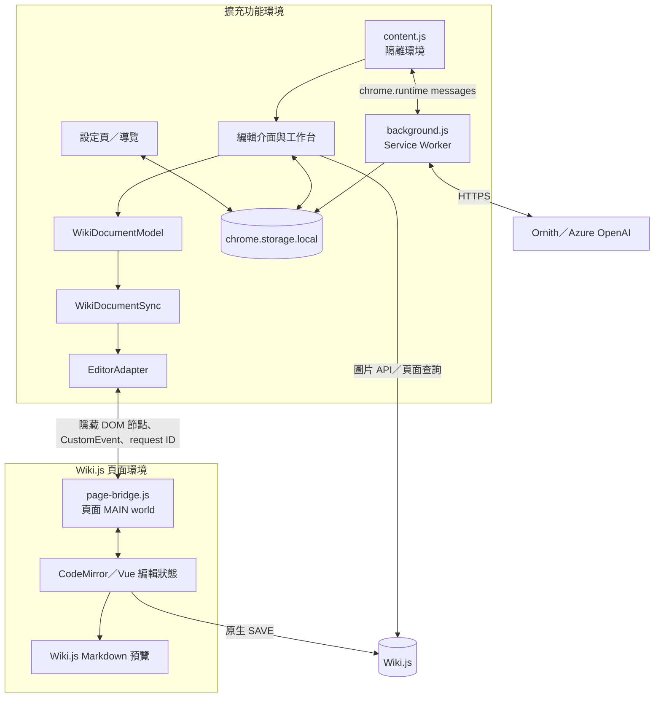
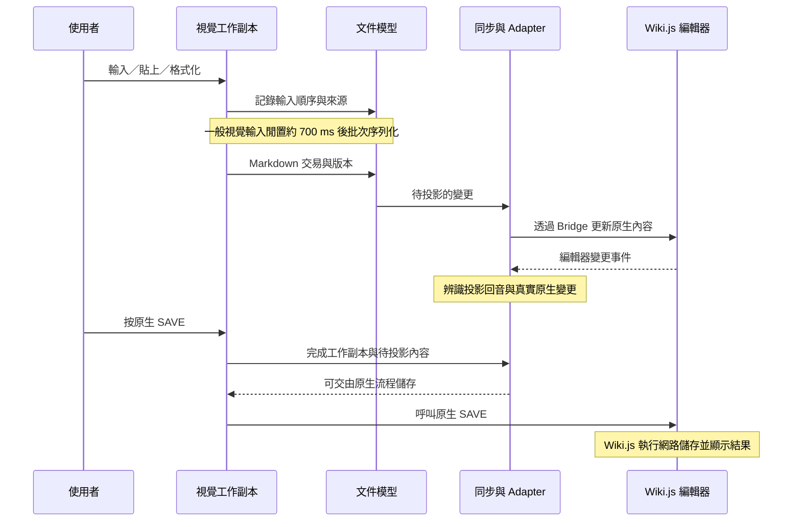

# 架構與資料流

Wiki Studio 在既有 Wiki.js 頁面加入工作台、視覺編輯與整理工具。TypeScript 是主要實作語言，介面以原生 DOM、Shadow DOM 和 CSS 建立；擴充功能使用 Manifest V3，不需要額外部署 Wiki Studio 後端。

## 執行環境

| 模組 | 職責 |
| --- | --- |
| `src/content/index.ts`、`page-observer.ts` | 依頁面與編輯器生命週期掛載／卸載功能，處理 Wiki.js SPA 換頁 |
| `wiki-document-model.ts` | 工作階段的 Markdown、交易、revision、輸入 journal、衝突候選與序列狀態 |
| `document-sync.ts` | 修改入口、原生變更接收、序列投影佇列、回音辨識、合併與衝突處理 |
| `editor-adapter.ts` | 以一致 API 讀寫選取範圍、內容與編輯歷史；主要整合 CodeMirror 5 |
| `bridge.ts`、`page-bridge.ts` | 跨隔離環境呼叫頁面編輯器；非同步請求依序執行，避免共用 DOM 節點的請求互相覆蓋 |
| `hybrid-preview.ts`、`hybrid-serialize.ts` | 視覺工作副本、Markdown／HTML 序列化、選取範圍與儲存前同步 |
| `image-drop.ts`、`wikijs-upload.ts`、`asset-review.ts` | 圖片插入、資料夾解析、上傳、縮圖瀏覽與資產管理 |
| `templates/`、`customers/`、`shared/storage.ts` | 模板、客戶目錄、分支與個人設定 |
| `background/`、`shared/*client.ts` | 背景訊息、AI Provider 驗證與 HTTPS 請求 |

## 文件同步

視覺畫面是使用者當下的工作副本；`WikiDocumentModel` 是已接受 Markdown 交易的工作階段模型；Wiki.js 負責最終的頁面持久化。三者用途不同，不能將「畫面已更新」當成「伺服器已儲存」。

每筆交易包含 `transactionId`、`baseRevision`、修改來源、文字差異與新版本。序列欄位分別追蹤目前輸入、模型內容、原生投影、預覽呈現與交給原生儲存的版本。`savedSeq` 記錄交付原生儲存流程的序列，**不是伺服器儲存成功的回應**。

同步佇列依序將交易投影到原生編輯器。來源標記與已知投影快照協助辨識回音；前景輸入世代與視覺版本避免遲到的預覽蓋過新輸入。可安全判斷的非重疊單區間修改可合併，重疊或無法確認的變更會保留衝突狀態並阻止盲目覆寫。這不是跨使用者的即時共同編輯協定，也不宣稱任意複雜差異都能自動合併。

Page Bridge 透過共享 DOM 節點的屬性與 `CustomEvent` 傳遞帶 ID 的請求／回應。這是擴充功能隔離環境與頁面 JavaScript 的溝通方式；共享 DOM 不應視為秘密儲存空間或獨立的安全邊界。AI Key 不需要經此 Bridge 傳遞。

## 圖片與資產

圖片流程使用目前 Wiki.js 登入工作階段。文章路徑先決定建議資料夾，接著透過 GraphQL 查詢／建立資料夾，使用 `/u` 的 multipart `mediaUpload` 欄位上傳，將資產 URL 插回 Markdown。可選擇文章路徑、父資料夾或手動資料夾策略；檔名處理與去重避免直接覆蓋同名資產。

視覺編輯中的上傳佔位標記用來定位非同步結果，避免等待上傳時新增的文字把插入位置弄錯；取消或失敗會處理原選取內容的還原。圖片樣式需要時序列化為相容的 HTML／Markdown，實際呈現仍受 Wiki.js renderer 與 HTML 清理規則影響。資產刪除是對 Wiki.js 圖片資料的實際修改，與刪除文章內一個圖片引用不同。

## AI 排版

有反白時處理選取範圍，否則處理全文。長文由 `markdown-chunk.ts` 分段，每段分別傳給所選服務。背景程式驗證設定、呼叫 Provider、解析 JSON；檢查原文內容保留、格式標籤等情況，回傳結果與警告。特定密碼值疑似遭遮蔽／改寫的結果會拒絕套用；這些檢查不能取代完整的人工內容審查，也不會在傳送前自動匿名化原文。

選取範圍套用時會再次定位原文，若原文已移動且無法唯一辨認，會停止套用。整篇套用會取代模型全文，所以等待全文排版時應避免另外修改文章。AI 結果不會自動儲存到 Wiki。

## 設定、權限與公開發行

`chrome.storage.local` 儲存設定、模板、客戶、資料夾與分支；不同擴充功能 ID 的資料互相獨立。API Key 也在本機設定內，並非以加密憑證庫儲存。備份可選擇排除或包含 Key；含 Key 備份必須當作憑證檔案處理。

manifest 宣告 `storage` 與特定網站權限：目標 Wiki、單一 Ornith origin，以及 Azure OpenAI 網域範圍。公開來源以 `wiki.example.invalid`、`ornith.example.invalid` 為示範值，不增加全網站權限。`Configure-Wiki.ps1` 將 Release 的 manifest 與編譯程式同步設定為使用者的網站；`.env` 則供原始碼建置時使用。完整步驟見 [安裝](INSTALL.md) 與 [發行](RELEASE.md)。
